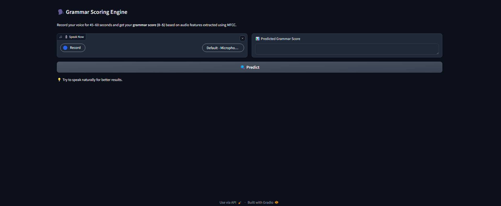

# 🧠 Grammar Scoring Engine

🎙️ A voice-based ML app that predicts grammar fluency score (0–5) from spoken audio samples using audio feature extraction (MFCC) and regression modeling.  
Built with **Gradio**, deployed on **Hugging Face Spaces**, and trained with real audio samples.

---

## 🚀 Live Demo

👉 **[Try the App on Hugging Face Spaces](https://huggingface.co/spaces/manmathbh/grammar-scoring)**  
📌 *No installation required – works directly in browser*

---

## 📖 Project Overview

The **Grammar Scoring Engine** is a machine learning project that leverages audio signal processing and regression modeling to evaluate grammar fluency in spoken English. 

Users are prompted to **speak naturally for 45–60 seconds**, and the model provides an objective **grammar score between 0 and 5**, based on audio features.

---

## 📷 Screenshots

### 🪟 Windows UI

### 📱 Android UI

---

## 🔍 Key Features

- 🎤 Voice recording using Gradio UI
- 🎛️ MFCC feature extraction via `librosa`
- 🤖 Regression model trained on audio-annotated dataset
- 📈 Evaluation using Pearson correlation
- 🖥️ Deployed on Hugging Face Spaces (free, public, portable)

---

## 🧠 Tech Stack

| Component         | Tool/Library                 |
|------------------|------------------------------|
| UI & Deployment  | Gradio + Hugging Face Spaces |
| Audio Processing | Librosa                      |
| ML Model         | Scikit-learn (LinearRegression) |
| Backend          | Python                       |
| Packaging        | Joblib                       |

---

## 🧪 Model Development

- **Dataset**: 444 training samples, 195 test samples (45–60s voice recordings)
- **Target Variable**: Continuous grammar score [0, 5]
- **Preprocessing**:
  - Noise handling
  - Silence detection
  - Resampling to 16kHz
- **Feature Engineering**:
  - MFCCs (13-coefficients)
  - Feature selection with correlation thresholding
- **Model**: Linear Regression
- **Evaluation Metric**: Pearson Correlation Coefficient

---

Made with 🧡 by Manmath Balaji Hatte